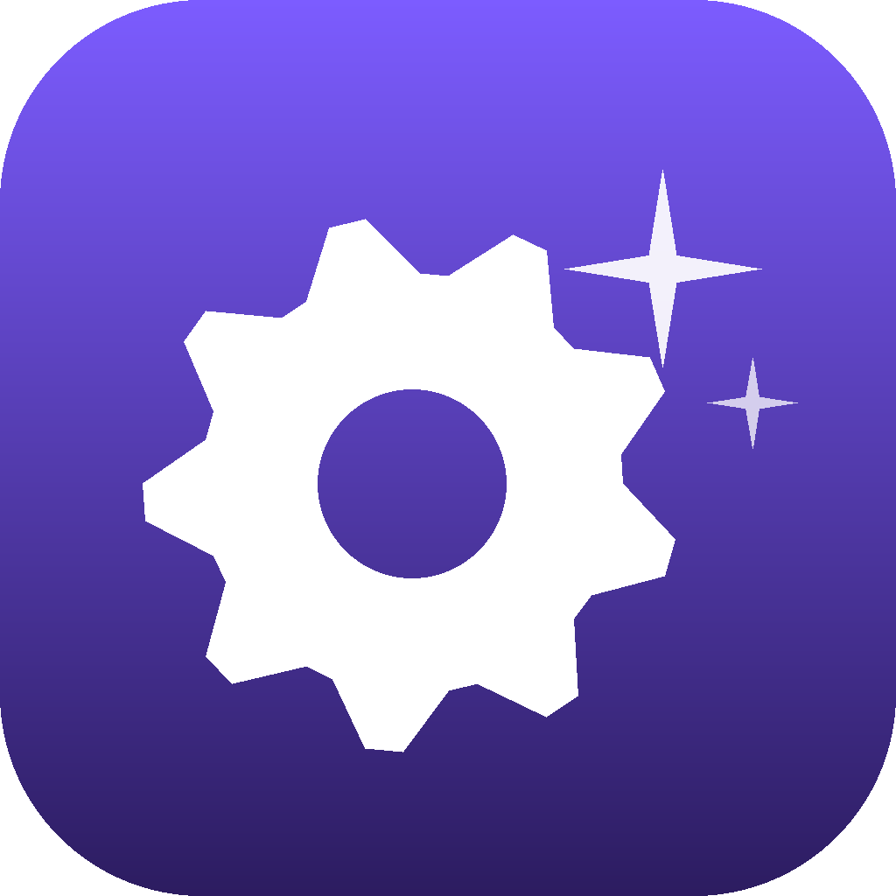

# 🏭 Skill Factory

**A Claude Code tool that studies how you actually work and writes new skills for you.**

You build [Claude Code skills](https://docs.claude.com/en/docs/claude-code/skills) to automate
chores. The hard part is *noticing* the chore worth automating. Skill Factory does the noticing:
it reads your own session history, finds the multi-step tasks you keep doing **by hand**, ranks
them, and drafts ready-to-install skills. You review and click install. Nothing lands without you.



## The trick

Every time one of your skills runs, Claude Code tags that action with the skill's name in the
session transcript. So the actions with **no tag** are the work you're still doing by hand. That
untagged pile, sorted by frequency, *is* your automation backlog. Skill Factory just reads it.

## How it works

Two stages, because your transcripts are big (hundreds of MB) and can't go into a prompt:

1. **Scan** (`scan.py`, pure Python stdlib, read-only) streams your transcripts
   (`~/.claude/projects/*/*.jsonl`) + skill-usage log, keeps only the manual multi-step turns,
   and boils them down to a tiny JSON digest.
2. **Draft** (`factory.sh`) makes **one** `claude -p` call that clusters the digest, ranks the
   top 5, and writes a complete `SKILL.md` for each. Output lands in `proposals/<stamp>/`.

A dumb script does the heavy lifting; the smart model does the judgment. Each does its part.

## Use it

### Web UI (easiest)

```bash
python3 app.py        # opens http://127.0.0.1:4321
```

Click **Generate** → get 5 ranked suggestions → **View** any draft → **Add to skills** (it shows
a diff and asks before overwriting an existing skill). On macOS, run `bash setup-launcher.sh`
once to get a double-clickable **Skill Factory.command** on your Desktop.

### Command line

```bash
bash factory.sh 30                       # scan the last 30 days, draft 5 skills
cat proposals/<stamp>/RANKING.md         # the ranked list + evidence
bash install.sh proposals/<stamp>/<name> # install one (asks to confirm; diffs on overwrite)
```

## Safety

- **Read-only** on your transcripts.
- Drafts go to `proposals/` for review first; **nothing** is written to `~/.claude/skills`
  without your explicit confirm, and an existing skill is never overwritten without a shown diff.
- No `ANTHROPIC_API_KEY` needed — it uses your `claude -p` subscription. The web server binds to
  `127.0.0.1` only.

## Requirements

- [Claude Code](https://docs.claude.com/en/docs/claude-code) on your `PATH` (`claude -p`).
- Python 3.9+ (stdlib only; the launcher icon also needs Pillow).

## Files

| File | Role |
|------|------|
| `scan.py` | Read-only transcript/log scanner → JSON digest (`--selfcheck` self-tests the parser) |
| `factory.sh` | Digest → one `claude -p` call → `proposals/<stamp>/proposals.json` + drafts |
| `app.py` | Local web UI (stdlib `http.server`) |
| `install.sh` | The only writer into `~/.claude/skills`; diff-guarded |
| `mkicon.py` / `setup-launcher.sh` | Build the macOS Desktop launcher + icon |

## Check

```bash
python3 scan.py --selfcheck
```

## License

MIT
